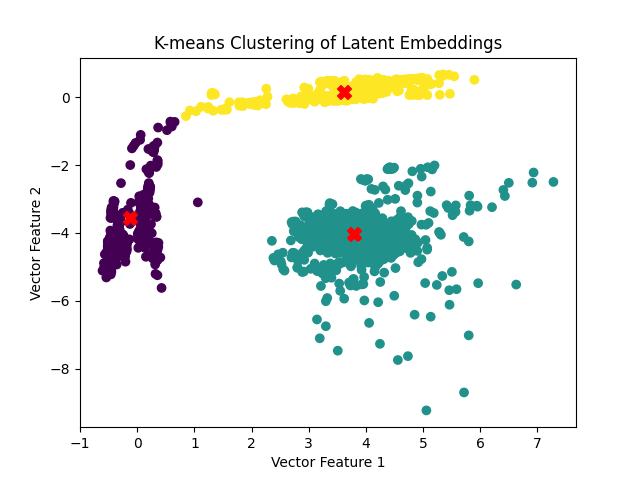

# COMP 6130 Final Report

## Group Members: Elliott Baker, Tonghui Li, and Alex Zhao

### DeepWalk: Online Learning of Social Representations

Our implementation of the DeepWalk algorithm involves two datasets: Zachary's karate club graph, and a social graph representing Twitch user relationships. The karate club graph is labeled while the Twitch data is unlabeled. For that reason, we use different approaches for classification in the two scenarios after the latent representations have been learned.

#### **1. Preprocessing and Obtaining the Data**

The [Karate dataset](https://networkx.org/documentation/stable/reference/generated/networkx.generators.social.karate_club_graph.html) is obtained easily by importing the networkx module and calling `nx.karate_club_graph()`. It does not require much preprocessing since it comes in a neat graph format already.

The [Twitch dataset](https://snap.stanford.edu/data/twitch_gamers.html) is obtained from a csv file that is preprocess in the `read_graph()` function in our code. Only a portion of the graph is used in order to help with run times.

#### **2. How to run our code**

The first way to run our code is to use the deepwalk.py file directly. In the command line where the deep_walk directory resides, type:

    python3 deepwalk.py [graph name] [embedding size] [walks/vertex] [walk length]

The second way to run our code is to run shell scripts that iteratively run the deepwalk algorithm, varying hyperparameters with each run. These scripts use the karate graph. To run this, type on of the three commands:

    ./karate_tune_embed_size.sh
    ./karate_tune_walk_length.sh
    ./karate_tune_walks_per_vertex.sh

#### **3. Results**

After training deepwalk, we obtain a vector with latent embeddings. Using this vector, we classify the data using a simple Logistic Regression (like the researchers used). However, with unlabeled data (like the Twitch graph) we use a K-means clustering to "cluster" the latent embeddings into classes. This approach accurately classifies members of the karate club into their respective classes.

The two scatter plots below show the predicted labels and actual labels for the trained model using karate graph.
 

The plot below shows an example of a random walk starting at vertex 0 in the karate graph.

The plot below shows the karate graph with colors as labels.

The plot below shows the results of deepwalk when embedding size is varied from 10-1000 on the karate graph.

The plot below shows the result of deepwalk when walk length is varied from 10-400 on the karate graph.

The plot below shows the result of deepwalk when walks per vertex is varied from 2-25 on the karate graph.

The plot below shows the clusters that are found after running deepwalk on a partition of the Twitch graph dataset with the following hyperparameters: window size=2, embedding size=2, walks per vertex=100, walk length=10

The plot below shows the clusters that are found after running deepwalk on a partition of the Twitch graph dataset with the following hyperparameters: window size=2, embedding size=2, walks per vertex = 10, walk length=100

walk length=1000

#### **4. Analysis**

Deepwalk is very effective at what it does. It can help with many different applications by borrowing from language modeling, and applying similar ideas to areas such as social network learning. The latent representations learned by Deepwalk are powerful, and very useful. However, the difficult aspect of Deepwalk is not getting the trained embedded vectors themselves. The most difficult part is making use of those latent representations to gain realistic knowledge. Using a logistic regression proved to be helpful in binary classification with labeled data. However, embedding size did not play the role we expected in determining classification accuracy metrics. As can be seen from the plot above, there is not a clear correlation between embedding size and accuracy. However, walk length and walks per vertex seem to be a better indicators of deepwalk success, as seen from the plotted results above.

#### **5. Environment Settings**

Python version: 3.10.12

Operating System: Windows 11 (WSL Ubuntu LTS 22.04)

IDE: Visual Studio Code
